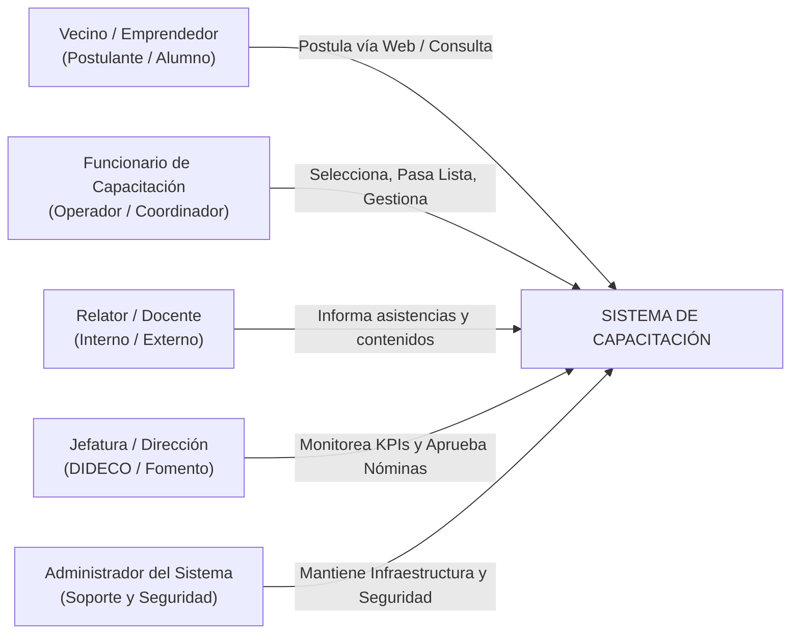
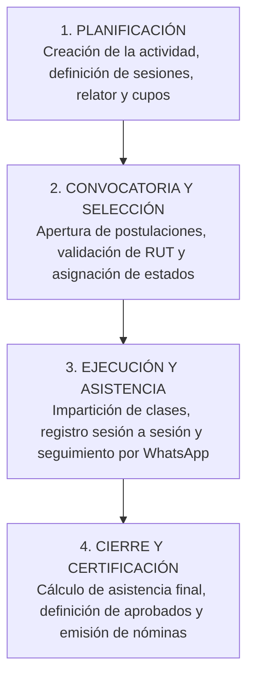

# Resumen Ejecutivo y Alcance del Sistema
## Departamento de Capacitación — Municipalidad de Santiago

---

### 1. Propósito de este Documento

Este documento describe la especificación operativa, el modelo de datos y las reglas de negocio del Sistema de Gestión de Capacitaciones (SIGC) de la Municipalidad de Santiago, estableciendo las bases funcionales y técnicas para su operación, mantención y evolución tecnológica.

El objetivo central es dotar a la Municipalidad de una herramienta tecnológica estandarizada que permita:
1. Terminar con el uso de planillas Excel dispersas y desconectadas.
2. Contar con un **Padrón Único de Beneficiarios** (vecinos y emprendedores) sin duplicados.
3. Medir con precisión matemática la **Participación Real y Efectiva** en los talleres y cursos (diferenciando postulantes brutos de vecinos efectivamente capacitados).
4. Agilizar la labor diaria de los funcionarios municipales en el control de asistencia, selección de postulantes y emisión de nóminas oficiales.

---

### 2. Contexto Operativo y Problemas a Resolver

| Situación Anterior (Planillas Sueltas) | Solución Requerida (Sistema Integrado) |
| :--- | :--- |
| **Duplicidad de personas:** Una misma persona figura con RUT con puntos, sin puntos, o solo por nombre, contabilizándose erróneamente varias veces. | **Identificador Único (`ID_PERSONA`):** Normalización estricta por RUT (Módulo 11) que unifica el historial del vecino en una sola ficha vitalicia. |
| **Métricas de impacto infladas:** Se reporta a Alcaldía y Concejo que "se capacitaron 3.000 personas", cuando en realidad eran 800 vecinos que tomaron múltiples cursos. | **Cruce Relacional N:M:** Distinción clara entre *Inscripciones Brutas* y *Personas Únicas Capacitadas*, respaldadas con porcentaje de asistencia real. |
| **Gestión manual y lenta de cupos:** Convocatorias masivas donde los funcionarios deben filtrar a mano cientos de filas para ver quién queda seleccionado o en lista de espera. | **Motor de Cupos Automatizado:** Conteo en tiempo real de cupos ocupados, disponibles y lista de espera con estados parametrizados. |
| **Pérdida de trazabilidad de asistencia:** Listas en papel que se traspasan con retraso o se extravían. | **Marcaje Digital Sesión a Sesión:** Registro ágil en un clic desde tablet o computador, con cálculo automático de aprobación/reprobación. |
| **Riesgo en datos personales:** Envío de nóminas con RUT, teléfonos y direcciones por canales informales. | **Seguridad y Perímetro Institucional:** Acceso restringido con autenticación corporativa, perfiles de usuario y trazabilidad de cambios (logs). |

---

### 3. Actores y Roles del Sistema

#### Descripción de Perfiles:
1. **Vecino / Emprendedor:**
   - Postula a actividades a través de formularios digitales accesibles.
   - Recibe notificaciones de selección, recordatorios por WhatsApp/correo y certificados de aprobación.
2. **Funcionario de Capacitación:**
   - Crea actividades, define fechas, horarios, cupos y número de sesiones.
   - Revisa las postulaciones, selecciona beneficiarios y administra la lista de espera.
   - Pasa asistencia digital en cada clase y genera nóminas oficiales de cierre.
   - Realiza seguimiento a participantes rezagados mediante contacto directo.
3. **Relator / Docente:**
   - Visualiza la nómina de su curso y reporta el cumplimiento de contenidos y asistencia.
4. **Jefatura y Dirección:**
   - Consulta el cuadro de mando (Dashboard) con estadísticas de cobertura comunal, género, grupos prioritarios (ej. PMJH) y tasas de aprobación.
5. **Administrador del Sistema:**
   - Gestiona permisos, integraciones de base de datos, respaldos y auditoría de seguridad.

---

### 4. Ciclo de Vida General de una Capacitación

El proceso de negocio se compone de cuatro grandes fases secuenciales:

---

### 5. Estructura de esta Carpeta de Documentación

Esta carpeta contiene la documentación y especificaciones del sistema:
* **`scripts_sistema/`**: Subcarpeta con la totalidad del código fuente (`.gs`, `.html`, `appsscript.json`) y la guía técnica de despliegue (`INSTRUCCIONES_DESPLIEGUE.md`).
* **`01_FLUJOGRAMA_PROCESOS_OPERATIVOS.md`**: Detalle paso a paso del flujo de trabajo de los funcionarios con diagramas visuales.
* **`02_MODELO_DE_DATOS_E_IDENTIFICADORES.md`**: Diagrama Entidad-Relación, lógica de generación de IDs únicos y reglas del cruce de datos para participación real.
* **`03_REQUERIMIENTOS_FUNCIONALES_Y_TECNICOS.md`**: Lista exhaustiva de requerimientos (RF/RNF) para desarrollo de software y base de datos.
* **`README.md`**: Índice general de contenidos y recomendaciones de uso.
