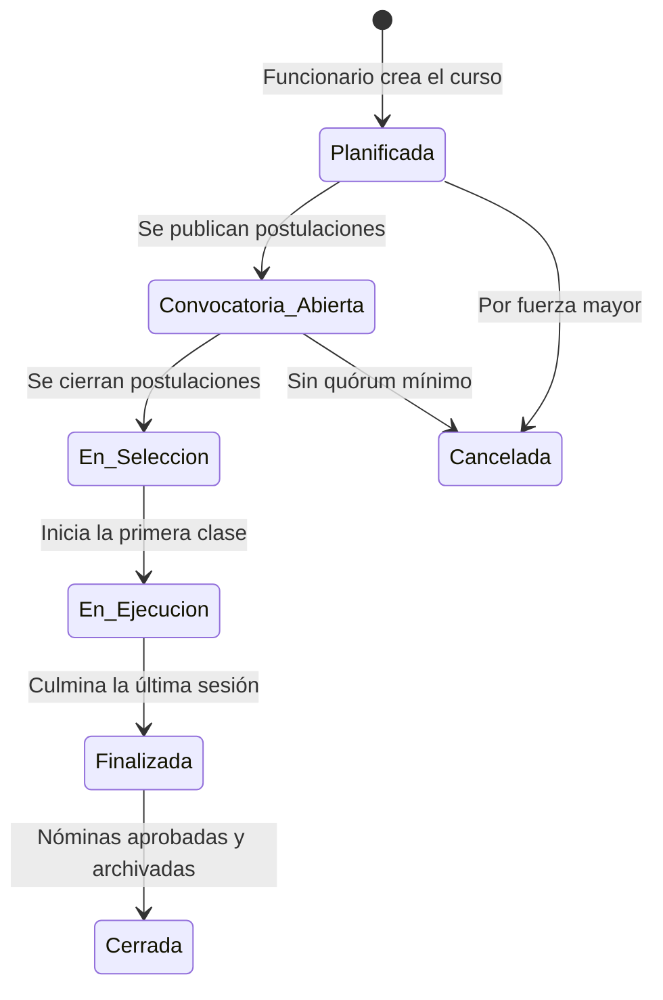
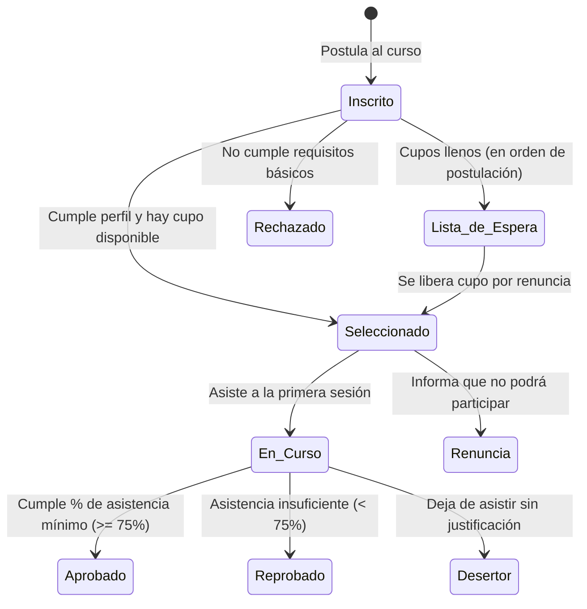
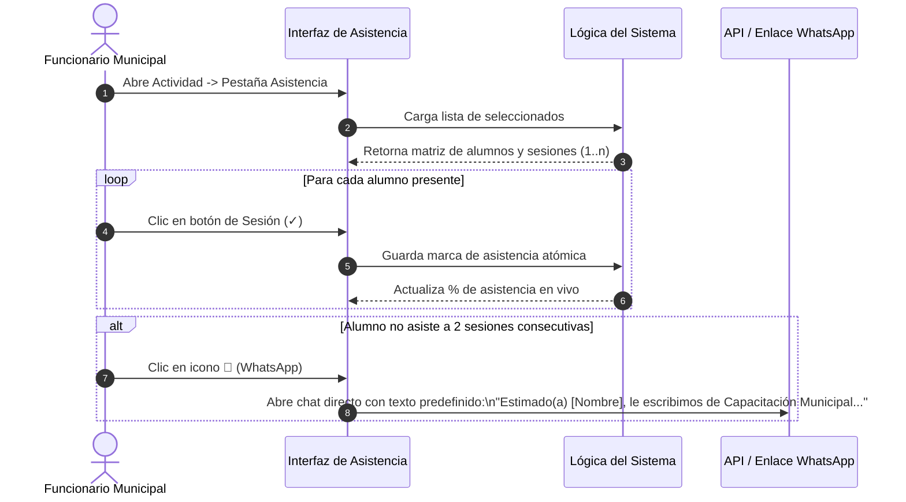

# Flujograma de Procesos Operativos del Departamento de Capacitación

Este documento detalla visual y funcionalmente el trabajo cotidiano de los funcionarios del departamento y cómo interactúan con los datos en cada etapa del servicio.

---

## 1. Flujograma Operativo General de Punta a Punta

```mermaid
flowchart TD
    classDef fase fill:#e0f2fe,stroke:#0284c7,stroke-width:2px,color:#0369a1,font-weight:bold;
    classDef accion fill:#f8fafc,stroke:#64748b,stroke-width:1px,color:#1e293b;
    classDef sistema fill:#f0fdf4,stroke:#16a34a,stroke-width:1px,color:#15803d;
    classDef salida fill:#fef3c7,stroke:#d97706,stroke-width:2px,color:#92400e,font-weight:bold;

    subgraph FASE1["FASE 1: Planificación y Convocatoria"]
        P1["Funcionario crea Actividad en el Sistema\n(Nombre, Cupos, Sesiones, Relator, Fechas)"] --> P2["Se abre período de postulación"]
        P2 --> P3["Vecinos postulan vía formulario digital o ventanilla"]
        P3 --> S1["Sistema valida RUT chileno y normaliza nombre"]
        S1 --> S2["Si el vecino ya existe: recupera su ficha maestra\nSi es nuevo: crea ficha única PER-XXXXXX"]
        S2 --> S3["Registra la postulación como PAR-XXXXXX\n(Estado inicial: 'Inscrito')"]
    end

    subgraph FASE2["FASE 2: Selección y Gestión de Cupos"]
        S3 --> G1["Funcionario abre la pantalla de Gestión del Curso"]
        G1 --> G2["Revisa postulantes y evalúa cumplimiento de requisitos"]
        G2 --> G3["Asigna estados:\n• Seleccionado (ocupa cupo)\n• Lista de Espera (reserva)\n• Rechazado / No Cumple"]
        G3 --> S4["Sistema actualiza contador de cupos en tiempo real\n(Impide sobrecupos accidentales)"]
        S4 --> G4["Funcionario envía confirmaciones o cita a inducción\n(vía WhatsApp o Correo institucional)"]
    end

    subgraph FASE3["FASE 3: Ejecución de Clases y Control de Asistencia"]
        G4 --> E1["Día de clase: Funcionario abre la Web App"]
        E1 --> E2["Accede a la lista de 'Seleccionados' de la actividad"]
        E2 --> E3["Pasa lista marcando Asistencia con un clic\n(Sesión 1, 2, 3... n)"]
        E3 --> S5["Sistema acumula asistencias por alumno y sesión\nCalcula % acumulado en tiempo real"]
        E1 --> E4["Funcionario detecta ausentes y envía aviso rápido por WhatsApp"]
        E4 --> E5["En caso de baja justificada: promueve a un alumno de Lista de Espera"]
    end

    subgraph FASE4["FASE 4: Cierre, Calificación y Nóminas"]
        S5 --> C1["Última clase concluida: Cierre de la actividad"]
        C1 --> S6["Sistema evalúa condición final de cada participante:\n• Si % Asistencia >= 75% -> 'Aprobado'\n• Si % Asistencia < 75% -> 'Reprobado'\n• Si nunca asistió -> 'Desertor'"]
        S6 --> C2["Funcionario genera y descarga la Nómina Oficial en Excel\n(Incluye datos de contacto, confirmados, asistencias y estado final)"]
        S6 --> C3["Emisión de Diplomas / Certificados institucionales"]
        C2 --> C4["Se reportan indicadores al Dashboard de Dirección"]
    end

    class FASE1,FASE2,FASE3,FASE4 fase;
    class P1,P2,P3,G1,G2,G3,G4,E1,E2,E3,E4,E5,C1,C2,C3,C4 accion;
    class S1,S2,S3,S4,S5,S6 sistema;
```

---

## 2. Matriz de Estados de la Actividad y de la Participación

Para que el equipo de desarrollo programe las transiciones de forma limpia, se especifican las máquinas de estado:

### A. Estados de la Actividad (`ACTIVIDADES.ESTADO`)

### B. Estados de la Participación del Alumno (`PARTICIPACIONES.ESTADO_PARTICIPACION`)

---

## 3. Subproceso de Control de Asistencia y Contacto Directo

El funcionario en terreno (en la sede municipal o sala de cómputo) necesita agilidad extrema.

---

## 4. Subproceso de Descarga de Nómina Oficial

La nómina oficial de participantes es el documento con valor administrativo que se entrega a las direcciones municipales y auditorías.

**Campos obligatorios que debe generar el sistema en el archivo Excel:**
1. `ID_ACTIVIDAD` y Nombre del Curso.
2. `ID_PERSONA` y `RUT` (formato estándar chileno).
3. Nombre Completo del participante.
4. Datos de Contacto (Teléfono y Correo Electrónico).
5. Indicador de Grupo Prioritario (ej. Participante PMJH - Programa Jefas de Hogar: Sí/No).
6. Total de Sesiones Programadas.
7. Desglose sesión a sesión (Sesión 1: Asistió/Ausente, Sesión 2, etc.).
8. Total Sesiones Asistidas y Porcentaje Final de Asistencia (`%`).
9. Estado Final (`Aprobado`, `Reprobado`, `Desertor`).
10. Fecha y hora de generación del reporte con usuario responsable.
