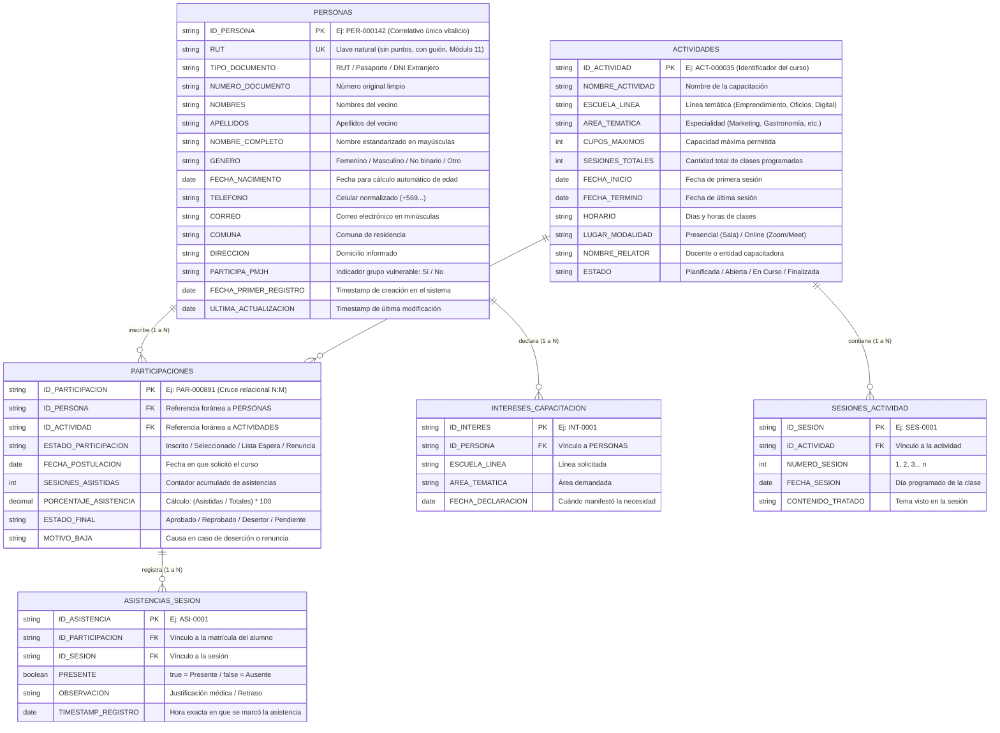
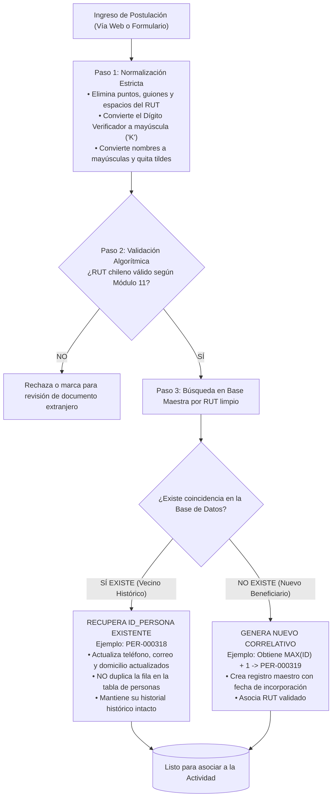
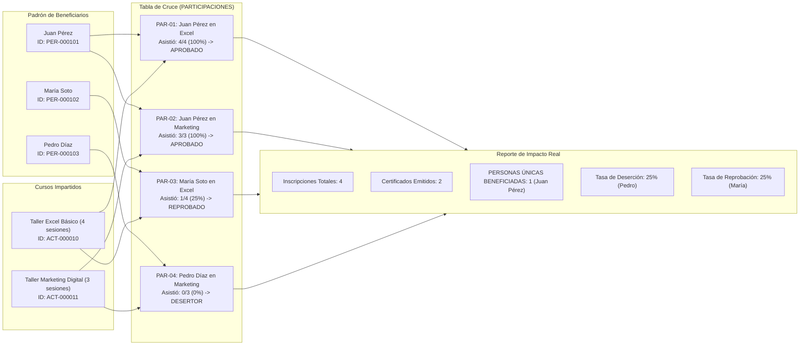

# Modelo de Datos, Identificadores y Participación Real

Este documento técnico explica la arquitectura relacional, la regla de generación de identificadores únicos y la metodología de cruce de datos para calcular la **participación real y efectiva** de los vecinos en las capacitaciones.

---

## 1. Diagrama Entidad-Relación (ERD)

El sistema opera bajo un modelo relacional en tercera forma normal (3NF) que separa estrictamente la **Persona (Beneficiario)**, la **Actividad (Curso)** y la **Participación (Matrícula y Asistencia)**.



---

## 2. Creación y Ciclo de Vida del Identificador de Persona (`ID_PERSONA`)

### A. Regla de Negocio
1. **Un solo ID por ser humano:** Cada vecino tiene una única ficha en la institución, sin importar cuántos años pasen ni cuántos cursos postule.
2. **Llave Natural vs Llave Subrogada:**
   - La **Llave Natural** es el `RUT` chileno (validado algorítmicamente mediante Módulo 11).
   - La **Llave Primaria Subrogada** es `ID_PERSONA` con estructura `PER-XXXXXX` (prefijo `PER-` seguido de un correlativo numérico de 6 dígitos con ceros a la izquierda, ej. `PER-000045`).
   - Para extranjeros sin RUN definitivo se normaliza su pasaporte o DNI de origen con un prefijo especial (ej. `EXT-XXXX`).

### B. Algoritmo de Normalización y Deduplicación



---

## 3. El Cruce de Datos para la "Participación Real"

Uno de los principales aportes de este diseño es eliminar el sesgo de **"Métricas Infladas"** en las estadísticas municipales.

### A. Definición de Conceptos

1. **Inscripciones Brutas (Demanda Nominal):** 
   - Suma total de registros en `PARTICIPACIONES` con estado `Inscrito`. 
   - Representa el interés de la ciudadanía, pero no indica si se capacitó.
2. **Seleccionados Efectivos (Cupos Utilizados):**
   - Participantes con estado `Seleccionado`. Ocupan la capacidad instalada del curso.
3. **Participación Real / Asistencia Efectiva:**
   - Registros con asistencia comprobada en al menos una clase (`SESIONES_ASISTIDAS >= 1`).
4. **Beneficiarios Aprobados (Impacto Concluido):**
   - Participantes que cumplieron la regla de aprobación institucional:
     $$\text{Porcentaje Asistencia} = \left(\frac{\text{Sesiones Asistidas}}{\text{Sesiones Totales}}\right) \times 100 \ge 75\%$$
5. **Personas Únicas Capacitadas (Métrica de Oro para Alcaldía):**
   - Cantidad de personas distintas (contando `COUNT(DISTINCT ID_PERSONA)`) que aprobaron al menos 1 actividad en el período. Si el vecino `PER-000142` aprobó 3 cursos en el año, cuenta como **1 persona única capacitada** y **3 certificaciones entregadas**.

### B. Matriz de Cruce y Trazabilidad



---

## 4. Estructura de Base de Datos Relacional (DDL PostgreSQL)

Para la implementación en un motor de base de datos relacional estándar, se detalla el esquema DDL estructurado:

```sql
-- 1. Tabla Maestra de Personas
CREATE TABLE personas (
    id_persona VARCHAR(12) PRIMARY KEY, -- Ej: PER-000001
    rut VARCHAR(12) UNIQUE NOT NULL,    -- Ej: 12345678-9
    tipo_documento VARCHAR(20) DEFAULT 'RUT',
    numero_documento VARCHAR(20) NOT NULL,
    nombre_completo VARCHAR(255) NOT NULL,
    genero VARCHAR(20),
    fecha_nacimiento DATE,
    telefono VARCHAR(20),
    correo VARCHAR(150),
    comuna VARCHAR(100) DEFAULT 'Santiago',
    direccion TEXT,
    participa_pmjh VARCHAR(2) DEFAULT 'No', -- 'Sí' o 'No'
    fecha_creacion TIMESTAMP DEFAULT CURRENT_TIMESTAMP,
    fecha_actualizacion TIMESTAMP DEFAULT CURRENT_TIMESTAMP
);

-- 2. Tabla de Actividades / Capacitaciones
CREATE TABLE actividades (
    id_actividad VARCHAR(12) PRIMARY KEY, -- Ej: ACT-000001
    nombre_actividad VARCHAR(255) NOT NULL,
    escuela_linea VARCHAR(100),
    area_tematica VARCHAR(100),
    cupos_maximos INT NOT NULL DEFAULT 20,
    sesiones_totales INT NOT NULL DEFAULT 1,
    fecha_inicio DATE,
    fecha_termino DATE,
    horario VARCHAR(100),
    modalidad VARCHAR(50) DEFAULT 'Presencial',
    relator VARCHAR(200),
    estado VARCHAR(30) DEFAULT 'Planificada'
);

-- 3. Tabla Cruce de Participaciones (N:M)
CREATE TABLE participaciones (
    id_participacion VARCHAR(12) PRIMARY KEY, -- Ej: PAR-000001
    id_persona VARCHAR(12) REFERENCES personas(id_persona) ON DELETE RESTRICT,
    id_actividad VARCHAR(12) REFERENCES actividades(id_actividad) ON DELETE CASCADE,
    estado_participacion VARCHAR(30) DEFAULT 'Inscrito',
    sesiones_asistidas INT DEFAULT 0,
    porcentaje_asistencia NUMERIC(5,2) DEFAULT 0.00,
    estado_final VARCHAR(30) DEFAULT 'Pendiente',
    fecha_postulacion TIMESTAMP DEFAULT CURRENT_TIMESTAMP,
    CONSTRAINT uq_persona_actividad UNIQUE (id_persona, id_actividad)
);

-- Índices de alto rendimiento
CREATE INDEX idx_personas_rut ON personas(rut);
CREATE INDEX idx_part_persona ON participaciones(id_persona);
CREATE INDEX idx_part_actividad ON participaciones(id_actividad);
CREATE INDEX idx_part_estado ON participaciones(estado_participacion, estado_final);
```
