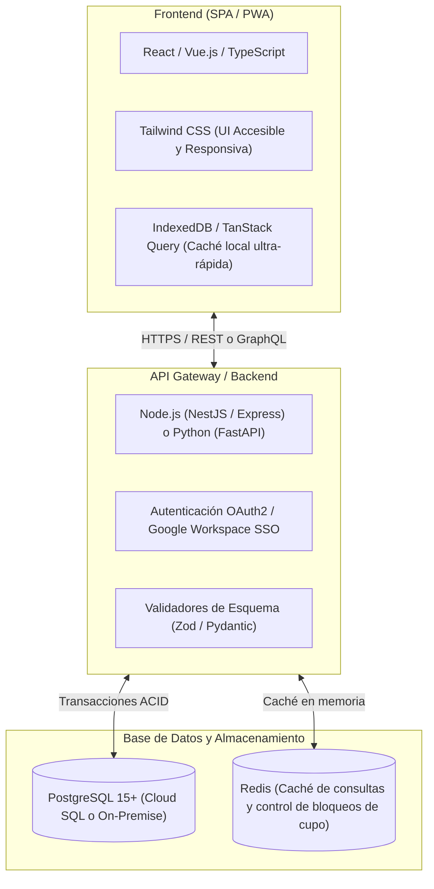

# Requerimientos Funcionales y Técnicos del Sistema

Este documento establece la especificación formal de requerimientos de software (SRS) del sistema institucional de capacitaciones, cubriendo necesidades funcionales, no funcionales y de arquitectura tecnológica.

---

## 1. Requerimientos Funcionales (RF)

### Módulo A: Gestión de Personas y Padrón Maestro
* **RF-01 (Validación de Identidad y Deduplicación):** El sistema debe validar el RUT chileno mediante algoritmo Módulo 11. Al ingresar un RUT, el sistema debe buscar automáticamente si la persona ya existe en la base maestra; si existe, debe cargar su ficha y no permitir la creación de un nuevo registro con el mismo documento.
* **RF-02 (Generación de Identificador Único):** A cada persona registrada se le debe asignar un código único correlativo (`ID_PERSONA`, formato `PER-XXXXXX`), el cual debe ser inmutable y acompañar al ciudadano a lo largo de toda su historia en el municipio.
* **RF-03 (Búsqueda Predictiva en Tiempo Real):** El sistema debe proveer un buscador con autocompletado en memoria (< 50 ms) que filtre concurrentemente por RUT (con o sin formato), nombre/apellido y correo electrónico.
* **RF-04 (Categorización de Grupos Prioritarios):** El sistema debe permitir registrar y filtrar atributos sociodemográficos clave, tales como género, rango etario, comuna y pertenencia al Programa Mujeres Jefas de Hogar (PMJH).

---

### Módulo B: Planificación de Actividades y Calendario
* **RF-05 (Creación de Actividades):** El sistema debe permitir crear capacitaciones indicando: Nombre, Línea/Escuela, Área temática, Cupos máximos, Total de sesiones programadas, Fechas de inicio/término, Horario, Modalidad (Presencial/Online), Relator y Lugar.
* **RF-06 (Calendario Visual Interactivo):** Debe existir una vista de calendario mensual/semanal donde los funcionarios puedan ver todas las actividades programadas, sus sesiones diarias y el estado de avance.
* **RF-07 (Verificación de Actividades Vencidas):** El sistema debe verificar periódicamente las fechas y cambiar de forma desatendida el estado de las actividades a "Finalizada" una vez transcurrida su última sesión.

---

### Módulo C: Postulación, Selección y Control de Cupos
* **RF-08 (Inscripción y Cruce N:M):** El sistema debe permitir registrar la postulación de una persona a una actividad creando un registro único en la tabla de cruce (`PARTICIPACIONES`), asignando un código `PAR-XXXXXX`.
* **RF-09 (Control de Cupos y Concurrencia):** El sistema debe contar los cupos en tiempo real:
  $$\text{Cupos Disponibles} = \text{Cupos Máximos} - \text{Total Seleccionados}$$
  Debe impedir de forma atómica que se seleccionen más personas que los cupos parametrizados.
* **RF-10 (Gestión de Estados de Postulación):** Los funcionarios deben poder cambiar fácilmente el estado de los postulantes en bloque o individualmente: *Inscrito*, *Seleccionado*, *Lista de Espera*, *Rechazado*.
* **RF-11 (Promoción Dinámica desde Lista de Espera):** Si un seleccionado renuncia o causa baja, el sistema debe permitir promover a un postulante de la lista de espera con un solo clic.

---

### Módulo D: Control de Asistencia y Seguimiento Operativo
* **RF-12 (Pase de Lista Rápido por Sesión):** La interfaz de gestión debe mostrar una cuadrícula con los alumnos seleccionados y columnas por cada sesión (Sesión 1 a $n$). El funcionario debe poder alternar el estado (Presente/Ausente) con un solo clic sobre la celda.
* **RF-13 (Cálculo Automático de Asistencia y Aprobación):** Por cada marca de asistencia, el sistema debe recalcular automáticamente:
  - Total de sesiones asistidas.
  - Porcentaje de asistencia acumulada: $(\text{Asistidas} / \text{Totales}) \times 100$.
  - Estado final del alumno: Si $\% \ge 75\% \to \textbf{Aprobado}$; si $\% < 75\% \to \textbf{Reprobado}$; si nunca asistió $\to \textbf{Desertor}$.
* **RF-14 (Contacto Rápido por WhatsApp y Correo):** Cada fila de participante debe incluir un enlace directo que abra WhatsApp Web con el número internacional sanitizado (+569...) y el correo del alumno para enviar recordatorios de clases o avisos de inasistencia.

---

### Módulo E: Reportería, Descarga de Nóminas y Demanda
* **RF-15 (Generación de Nómina Oficial en Excel):** El sistema debe exportar planillas Excel (.xlsx / .csv) que contengan: datos de identificación, contacto, condición de confirmación, desglose de asistencia por sesión y estado final. Debe permitir descargar la nómina completa o filtrar exclusivamente por los confirmados/aprobados.
* **RF-16 (Levantamiento de Demanda e Intereses):** El sistema debe permitir registrar qué áreas o cursos demandan los vecinos (`INTERESES_CAPACITACION`) para que la dirección planifique la oferta del próximo semestre según datos reales.
* **RF-17 (Dashboard Estadístico):** Panel gráfico con KPIs automáticos: Total de Personas Únicas Beneficiadas, Tasa de Aprobación, Tasa de Deserción, Distribución por Género y Cobertura Territorial.

---

## 2. Requerimientos No Funcionales (RNF)

| Código | Dimensión | Especificación Técnica |
| :--- | :--- | :--- |
| **RNF-01** | **Seguridad y Perímetro** | Acceso restringido exclusivamente a cuentas del dominio municipal (`@munistgo.cl`) mediante OAuth2 / Google Workspace SSO. Ningún dato sensible debe exponerse públicamente. |
| **RNF-02** | **Protección de Datos (Ley 19.628)** | El sistema no debe exponer datos personales (RUT, teléfonos, direcciones) en código del cliente, URLs ni logs públicos. Los datos en tránsito deben usar HTTPS (TLS 1.3). |
| **RNF-03** | **Anti-Clickjacking y Cabeceras** | La aplicación web debe configurar encabezados `X-Frame-Options: SAMEORIGIN` o `DEFAULT` y `Content-Security-Policy` para evitar ataques de incrustación de interfaz no autorizada. |
| **RNF-04** | **Sanitización de Exportaciones** | En las descargas de Excel/CSV se debe implementar sanitización contra *CSV / Formula Injection*, prefijando con comilla simple (`'`) cualquier campo de texto que inicie con `=`, `+`, `-` o `@`. |
| **RNF-05** | **Concurrencia Atómica** | El backend debe utilizar mecanismos de bloqueo (tipo `LockService` o transacciones ACID con `SELECT ... FOR UPDATE`) para evitar que dos funcionarios asignen simultáneamente el último cupo de una capacitación. |
| **RNF-06** | **Rendimiento y Offline-First** | La interfaz de usuario debe cargar los datos maestros en la caché local del navegador (IndexedDB) para lograr tiempos de respuesta de filtrado inferiores a **100 milisegundos**, con opción de purga forzada al actualizar. |
| **RNF-07** | **Trazabilidad y Auditoría** | Cada acción de creación, modificación o eliminación debe registrar en una tabla de auditoría: `Usuario`, `Timestamp`, `Acción Realizada`, `ID del Objeto` y `Detalle de Cambios`. |

---

## 3. Arquitectura Técnica y Stack Sugerido

En caso de evolucionar la infraestructura actual hacia un stack corporativo independiente sobre base de datos relacional, la arquitectura recomendada es la siguiente:

### Ventajas de esta Arquitectura:
1. **Desacoplamiento Total:** La lógica de negocio está separada de la base de datos y de la interfaz gráfica.
2. **Escalabilidad Municipal:** Permite integrar el módulo de capacitaciones con otros sistemas municipales (ej. Ficha Vecino, OMIL, Fomento Productivo, DIDECO).
3. **Migración Directa:** El esquema de datos del SIGC actual ya cuenta con normalización en 3NF, por lo que la migración de datos hacia PostgreSQL o MySQL es inmediata y no requiere transformar estructuras complejas.
