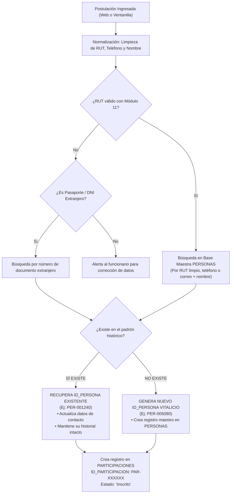
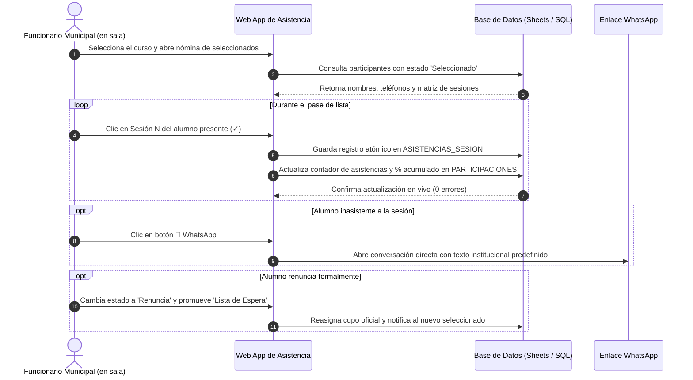
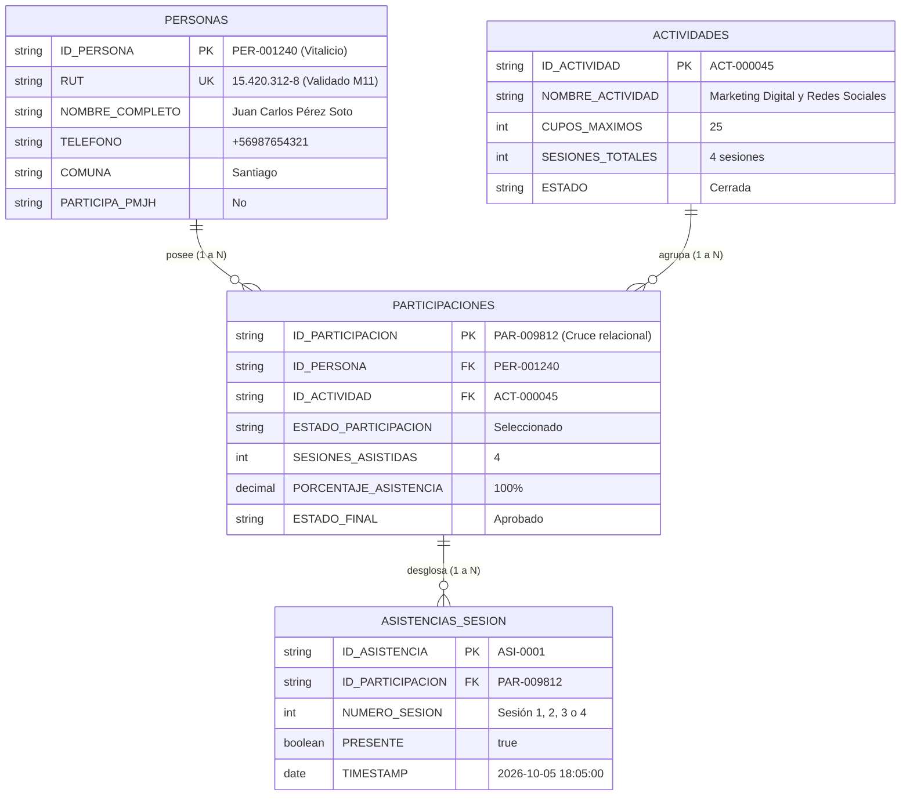

# Flujograma Integral: Datos de Capacitación y Gestión Operativa de Funcionarios
### Departamento de Capacitación — Municipalidad de Santiago

---

## 1. Introducción y Propósito del Documento

Este documento consolida en un solo flujo integral el **trabajo diario que realizan los funcionarios del Departamento de Capacitación** y el **viaje, transformación y cruce de los datos** a lo largo de todo el ciclo de vida de un curso.

El objetivo central es reflejar fielmente cómo la labor operativa (publicar un taller, recibir postulantes, seleccionar cupos, pasar lista en sala y emitir certificaciones) interactúa con las bases de datos para garantizar tres principios fundamentales:
1. **Padrón Único y Vitalicio de Beneficiarios:** Cada vecino posee una sola ficha en la institución (`ID_PERSONA`), sin importar cuántos años pasen ni cuántos cursos postule, evitando duplicados por variaciones de RUT, teléfono o nombres.
2. **Medición de la Participación Real:** Diferenciar con exactitud entre la **demanda nominal** (postulantes brutos), la **asistencia efectiva** (quienes realmente pisaron el aula) y las **personas únicas capacitadas** (eliminando el sesgo de vecinos que realizan múltiples cursos).
3. **Agilidad en la Operación Municipal:** Dotar a los funcionarios de herramientas directas para controlar cupos en tiempo real, tomar asistencia con un solo clic y contactar a los alumnos de manera oportuna.

---

## 2. Flujograma General Integrado: Trabajo del Funcionario y Flujo del Dato

El siguiente diagrama de carriles ilustra cómo cada acción del funcionario detona una operación concreta en la estructura de datos:

```mermaid
flowchart TD
    classDef func fill:#e0f2fe,stroke:#0284c7,stroke-width:2px,color:#0369a1,font-weight:bold;
    classDef dato fill:#f0fdf4,stroke:#16a34a,stroke-width:2px,color:#15803d,font-weight:bold;
    classDef sistema fill:#f8fafc,stroke:#64748b,stroke-width:1px,color:#1e293b;
    classDef metric fill:#fef3c7,stroke:#d97706,stroke-width:2px,color:#92400e,font-weight:bold;

    subgraph ETAPA1["1. PLANIFICACIÓN Y CONVOCATORIA"]
        F1["Funcionario planifica el curso:\nNombre, fechas, cupos, sesiones, relator"]
        D1[("Nace registro en ACTIVIDADES\nID_ACTIVIDAD: ACT-000045\nCupos disponibles = Máximo")]
        F1 --> D1
        F2["Funcionario abre postulaciones\ny publica formulario digital o ventanilla"]
        D1 --> F2
    end

    subgraph ETAPA2["2. POSTULACIÓN Y GENERACIÓN DEL ID"]
        F3["Vecino envía su postulación\n(RUT, nombre, teléfono, correo)"]
        F2 --> F3
        S1["Sistema normaliza datos y valida RUT chileno\n(Módulo 11, eliminación de puntos y guiones)"]
        F3 --> S1
        S2{"¿Vecino ya existe en el padrón?"}
        S1 --> S2
        D2A["SÍ: Recupera ficha existente\nID_PERSONA: PER-001240\nActualiza teléfono y correo"]
        D2B["NO: Genera nuevo ID vitalicio\nID_PERSONA: PER-005080\nCrea ficha maestra en PERSONAS"]
        S2 -- "Existe" --> D2A
        S2 -- "Nuevo" --> D2B
        D3[("Nace registro de postulación en PARTICIPACIONES\nID_PARTICIPACION: PAR-009812\nCruce: ID_PERSONA + ID_ACTIVIDAD\nEstado inicial: 'Inscrito'")]
        D2A --> D3
        D2B --> D3
    end

    subgraph ETAPA3["3. SELECCIÓN Y ADMINISTRACIÓN DE CUPOS"]
        F4["Funcionario revisa postulantes en la Web App\nEvalúa perfil y requisitos del curso"]
        D3 --> F4
        F5["Funcionario asigna estados:\n• Seleccionado (ocupa cupo oficial)\n• Lista de Espera (reserva ordenada)\n• Rechazado (no cumple requisitos)"]
        F4 --> F5
        D4["Sistema actualiza contador de cupos en tiempo real\nBloquea sobrecupos accidentales"]
        F5 --> D4
        F6["Funcionario confirma asistencia\n(vía WhatsApp con plantilla o correo)"]
        D4 --> F6
    end

    subgraph ETAPA4["4. EJECUCIÓN Y CONTROL DE ASISTENCIA EN SALA"]
        F7["Día de clase: Funcionario abre la vista de gestión\nen tablet o computador"]
        F6 --> F7
        F8["Funcionario pasa lista con 1 clic por sesión\n(Sesión 1, 2, 3... n)"]
        F7 --> F8
        D5[("Guarda asistencia atómica en ASISTENCIAS_SESION\nAcumula SESIONES_ASISTIDAS\nCalcula % Asistencia en vivo")]
        F8 --> D5
        F9["Funcionario detecta inasistencias reiteradas\ny envía recordatorio directo por WhatsApp"]
        D5 -.-> F9
        F10["Si alumno renuncia: Funcionario promueve\nal primero de la Lista de Espera"]
        F9 -.-> F10
        F10 --> D4
    end

    subgraph ETAPA5["5. CIERRE, EVALUACIÓN Y MEDICIÓN REAL"]
        F11["Última clase concluida: Funcionario cierra el curso"]
        D5 --> F11
        S3["Sistema evalúa condición final automáticamente:\n• Si % Asistencia >= 75% -> 'Aprobado'\n• Si % Asistencia < 75% -> 'Reprobado'\n• Si asistencias = 0 -> 'Desertor'"]
        F11 --> S3
        D6["Nómina Oficial consolidada en Excel\n(Lista para auditoría y firmas)"]
        S3 --> D6
        D7["Emisión de Diplomas / Certificados"]
        S3 --> D7
        M1["MÉTRICAS DE IMPACTO REAL:\n1. Demanda Nominal (Total inscritos)\n2. Asistentes Reales (Asistieron >= 1 clase)\n3. Aprobados Efectivos (Cumplieron >= 75%)\n4. Personas Únicas Capacitadas (RUTs distintos)"]
        S3 --> M1
    end

    class F1,F2,F4,F5,F6,F7,F8,F9,F10,F11 func;
    class D1,D2A,D2B,D3,D4,D5,D6,D7 dato;
    class S1,S2,S3 sistema;
    class M1 metric;
```

---

## 3. Desglose Paso a Paso: El Trabajo del Funcionario y el Viaje del Dato

### Fase 1: Planificación y Oferta Formativa
* **¿Qué hace el funcionario?**
  1. Ingresa al módulo de Actividades del sistema.
  2. Registra los datos de la capacitación: Nombre del curso, Línea temática (Oficios, Emprendimiento, Digital), Horario, Lugar/Sede, Nombre del Relator, Cantidad de Sesiones Totales programadas y Cupo Máximo permitido.
  3. Publica la actividad cambiando su estado a `Inscripción abierta`.
* **¿Qué ocurre con los datos?**
  - Se genera un registro único en la tabla `ACTIVIDADES` con la clave primaria `ID_ACTIVIDAD` (ejemplo: `ACT-000045`).
  - Se fija el contador de sesiones totales ($N$) que servirá de denominador para el cálculo porcentual de asistencia.
  - Se inicializa el contador de cupos disponibles (`CUPOS_DISPONIBLES = CUPOS_MAXIMOS`).

---

### Fase 2: Convocatoria, Postulación y Generación del Identificador Único (`ID_PERSONA`)
* **¿Qué hace el funcionario?**
  1. Difunde el enlace del formulario de postulación entre los vecinos de la comuna.
  2. En caso de atención presencial en ventanilla, el funcionario digita los antecedentes del postulante directamente en la plataforma.
* **¿Qué ocurre con los datos?**
  - El sistema ejecuta un proceso de **normalización y validación algorítmica**:
    - Limpia el RUT eliminando puntos, espacios y guiones.
    - Valida el Dígito Verificador mediante el algoritmo oficial de Módulo 11 chileno.
    - Normaliza nombres y apellidos a mayúsculas sin tildes incongruentes.
    - Estandariza números de teléfono móvil al formato nacional (`+569...`).
  - **Deduplicación e Identificador Único (`ID_PERSONA`):**
    - Se consulta la base maestra de `PERSONAS`.
    - **Caso A (Vecino Histórico):** Si el RUT ya existe (incluso si en registros antiguos no tenía dígito verificador, o si coincide el teléfono/correo con un nombre compatible), **el sistema no crea una nueva fila**. Recupera su identificador existente (ej. `PER-001240`) y actualiza sus datos de contacto recientes.
    - **Caso B (Nuevo Beneficiario):** Si no existe, genera un nuevo correlativo vitalicio con formato `PER-XXXXXX` (ej. `PER-005080`).
  - **Generación de la Participación (`ID_PARTICIPACION`):**
    - Se crea un nuevo registro en la tabla de cruce `PARTICIPACIONES` con su propia clave primaria `ID_PARTICIPACION` (ej. `PAR-009812`), vinculando `ID_PERSONA` con `ID_ACTIVIDAD` en estado inicial `Inscrito`.

---

### Fase 3: Selección de Beneficiarios y Administración de Cupos
* **¿Qué hace el funcionario?**
  1. Accede a la pantalla de **Gestión de la Actividad**.
  2. Filtra y revisa la lista de postulantes según los criterios de focalización (por ejemplo: vecinos que residen en la comuna, mujeres pertenecientes al Programa Jefas de Hogar `PMJH`, o postulantes sin capacitaciones previas).
  3. Modifica el estado del postulante con un clic:
     - `Seleccionado`: El vecino ingresa a la nómina oficial del curso.
     - `Lista de Espera`: Reserva ordenada por fecha de postulación.
     - `Rechazado`: No cumple con los requisitos del taller.
  4. Desde la misma interfaz, presiona el botón de **WhatsApp** o **Correo** para enviar una notificación personalizada con fecha, hora y sala de la primera clase.
* **¿Qué ocurre con los datos?**
  - El sistema actualiza el campo `ESTADO_PARTICIPACION` en `PARTICIPACIONES`.
  - El motor de control de cupos recalcula los totales en tiempo real:
    $$\text{Cupos Ocupados} = \sum (\text{Participaciones con estado 'Seleccionado'}) \le \text{CUPOS\_MAXIMOS}$$
  - Si los cupos se completan, el sistema advierte al funcionario para evitar sobrecupos accidentales.

---

### Fase 4: Ejecución y Control de Asistencia en Sala
* **¿Qué hace el funcionario?**
  1. Al inicio de cada clase, el funcionario ingresa a la Web App desde su computador o dispositivo móvil.
  2. Selecciona la actividad y visualiza la lista de alumnos `Seleccionados`.
  3. **Pasa lista en 1 clic:** Marca la casilla correspondiente a la sesión del día (Sesión 1, Sesión 2, etc.) para cada alumno presente. La columna de nombres permanece fija para facilitar el desplazamiento en pantallas pequeñas.
  4. **Seguimiento a inasistencias:** Si un alumno no asiste, el funcionario pulsa el icono de WhatsApp junto al nombre para enviar un mensaje predeterminado: *"Estimado(a) Juan, notamos que hoy no asistió a su clase de Capacitación Municipal. Favor comunicarse para coordinar su continuidad."*
  5. **Gestión de renuncias:** Si un alumno avisa que no podrá continuar, el funcionario cambia su estado a `Renuncia` e inmediatamente promueve al primer vecino de la `Lista de Espera` al estado `Seleccionado`.
* **¿Qué ocurre con los datos?**
  - Cada clic de asistencia genera o actualiza un registro atómico en la tabla `ASISTENCIAS_SESION`:
    - `ID_PARTICIPACION`
    - `NUMERO_SESION` (1, 2, 3...)
    - `PRESENTE` (`true` / `false`)
    - `TIMESTAMP_REGISTRO` (fecha y hora exacta del pase de lista).
  - En la tabla `PARTICIPACIONES` se actualiza automáticamente el acumulador:
    $$\text{SESIONES\_ASISTIDAS} = \sum (\text{Sesiones marcadas como presentes})$$
    $$\text{PORCENTAJE\_ASISTENCIA} = \left(\frac{\text{SESIONES\_ASISTIDAS}}{\text{SESIONES\_TOTALES}}\right) \times 100$$

---

### Fase 5: Cierre, Calificación y Medición de la Participación Real
* **¿Qué hace el funcionario?**
  1. Concluida la última sesión, el funcionario revisa que todas las asistencias estén registradas y justificadas.
  2. Presiona el botón de **Cierre de Actividad**.
  3. Descarga la **Nómina Oficial en Excel**, la cual incluye el desglose de cada clase, el porcentaje final, el estado de aprobación y los datos de contacto.
  4. Emite los diplomas o certificados oficiales de los alumnos aprobados.
* **¿Qué ocurre con los datos?**
  - **Calificación automática de la participación:**
    - Si $\text{Porcentaje de Asistencia} \ge 75\% \implies \text{ESTADO\_FINAL} = \text{'Aprobado'}$.
    - Si $\text{Porcentaje de Asistencia} < 75\%$ y asistió al menos a 1 clase $\implies \text{ESTADO\_FINAL} = \text{'Reprobado'}$.
    - Si nunca asistió ($\text{Sesiones Asistidas} = 0$) $\implies \text{ESTADO\_FINAL} = \text{'Desertor'}$.
  - El curso en `ACTIVIDADES` pasa a estado `Ejecutada` o `Cerrada`.
  - El cuadro de mandos (Dashboard) procesa las métricas de participación real.

---

## 4. El Cruce Relacional: Cómo se Mide la Participación Real

El sistema utiliza un cruce relacional de tres niveles para garantizar que las cifras entregadas a la jefatura municipal reflejen la realidad sin duplicidades ni métricas infladas.

### Tabla Comparativa de Indicadores de Impacto

| Nivel de Métrica | Nombre Institucional | Fórmula / Lógica de Cálculo | Significado para la Gestión Municipal |
| :--- | :--- | :--- | :--- |
| **Nivel 1** | **Demanda Nominal (Inscripciones Brutas)** | $\text{COUNT}(\text{PARTICIPACIONES})$ donde $\text{ESTADO} = \text{'Inscrito'}$ | Mide el interés ciudadano y la necesidad comunal por la temática ofrecida. |
| **Nivel 2** | **Cupos Ocupados (Seleccionados)** | $\text{COUNT}(\text{PARTICIPACIONES})$ donde $\text{ESTADO} = \text{'Seleccionado'}$ | Mide la utilización efectiva de la capacidad de salas y relatores contratados. |
| **Nivel 3** | **Participación Real (Asistentes Efectivos)** | $\text{COUNT}(\text{PARTICIPACIONES})$ con $\text{SESIONES\_ASISTIDAS} \ge 1$ | Descarta a postulantes fantasma; mide a quienes realmente asistieron a clases. |
| **Nivel 4** | **Beneficiarios Aprobados** | $\text{COUNT}(\text{PARTICIPACIONES})$ con $\text{ESTADO\_FINAL} = \text{'Aprobado'}$ | Mide el éxito formativo de la actividad (asistencia $\ge 75\%$). |
| **Nivel 5 (Métrica de Oro)** | **Personas Únicas Capacitadas** | $\text{COUNT}(\text{DISTINCT } \text{ID\_PERSONA})$ aprobadas en el año | **Métrica real de impacto:** Si una vecina aprueba 3 cursos en el año, cuenta como **1 persona única capacitada** y **3 certificaciones emitidas**. |

---

## 5. Matriz Resumen: Trabajo del Funcionario vs. Flujo de Datos

| Etapa | Trabajo Operativo del Funcionario | Datos que Ingresan | Reglas y Procesamiento del Sistema | Datos que Salen |
| :--- | :--- | :--- | :--- | :--- |
| **1. Planificación** | Define temáticas, fechas, sedes, cupos y relatores en la plataforma. | Parámetros del curso: cupos, $N$ sesiones, horario, sede. | Generación de clave primaria `ACT-XXXXXX`. Inicialización de matriz de sesiones. | Actividad disponible en catálogo (`ACTIVIDADES`). |
| **2. Postulación** | Difunde convocatorias y asiste en postulaciones presenciales. | Formulario web o ventanilla: RUT, nombres, contacto, PMJH. | Normalización de RUT (Módulo 11). Consulta en `PERSONAS`. Si existe, recupera ID; si es nuevo, crea `PER-XXXXXX`. | Postulación registrada como `PAR-XXXXXX` en estado `Inscrito`. |
| **3. Selección** | Revisa requisitos, asigna seleccionados y lista de espera. Envía avisos por WhatsApp. | Criterios de focalización y selección de beneficiarios. | Control estricto de cupos en tiempo real. Bloqueo de sobrecupos accidentales. | Nómina de seleccionados confirmada con cupos asignados. |
| **4. Asistencia** | Abre la lista en sala y marca la presencia de cada alumno en 1 clic. Contacta inasistentes. | Clic en sesión (presencia/ausencia), motivos de inasistencia o baja. | Inserción atómica en `ASISTENCIAS_SESION`. Sumatoria de asistidas y cálculo de `%` al instante. | Porcentaje de asistencia actualizado en vivo por alumno. |
| **5. Cierre** | Da por terminado el curso, revisa justificaciones y genera nómina oficial. | Confirmación de cierre de la actividad. | Evaluación de regla institucional ($\ge 75\% = \text{Aprobado}$). Bloqueo de edición del curso. | Nómina Oficial en Excel, Diplomas y KPIs para jefatura. |

---

## 6. Caso de Estudio Práctico: Trazabilidad de una Vecina de Punta a Punta

Para ilustrar con total claridad la interacción entre el trabajo del funcionario y los datos, consideremos el caso de la vecina **Rosa Morales**:

1. **Semana 1 (Planificación):**
   - El funcionario crea el taller *"Manipulación de Alimentos"* (`ACT-000050`), con 20 cupos y 4 sesiones presenciales.
2. **Semana 2 (Postulación):**
   - Rosa ingresa al formulario y digita su RUT `14.882.319-5`.
   - El sistema limpia el documento (`14882319-5`), verifica el Módulo 11 y busca en el padrón. Como Rosa tomó un curso de alfabetización digital hace dos años, el sistema localiza su ficha existente `PER-000412`.
   - Actualiza su número de WhatsApp y registra su nueva postulación `PAR-002105` en estado `Inscrito`. No se duplica su ficha.
3. **Semana 3 (Selección):**
   - El funcionario filtra a los postulantes de Santiago Centro y confirma que Rosa cumple con el perfil. Cambia su estado a `Seleccionado`.
   - Desde la plataforma, el funcionario presiona el botón de WhatsApp y envía el mensaje de bienvenida con el horario de clases.
4. **Semana 4 y 5 (Clases y Asistencia en Sala):**
   - **Clase 1:** Rosa asiste puntual. El funcionario marca un clic en la columna S1. Asistencias: $1/4$ ($25\%$).
   - **Clase 2:** Rosa asiste. El funcionario marca S2. Asistencias: $2/4$ ($50\%$).
   - **Clase 3:** Rosa tiene un inconveniente y falta. El funcionario deja la casilla vacía. Al notar su ausencia, el funcionario le escribe un mensaje por WhatsApp consultando el motivo. Rosa responde que presentará justificación médica.
   - **Clase 4:** Rosa asiste a la clase final. El funcionario marca S4. Asistencias: $3/4$ ($75\%$).
5. **Semana 6 (Cierre y Certificación):**
   - El funcionario cierra el curso en el sistema.
   - El sistema calcula: $3 \text{ asistidas} / 4 \text{ totales} = 75\%$.
   - Como cumple con el mínimo ($75\% \ge 75\%$), su estado final se establece automáticamente en **Aprobado**.
   - El funcionario descarga la nómina oficial en Excel con el desglose sesión a sesión y le imprime su certificado de aprobación.
   - **En el informe de gestión de fin de año:** Rosa suma **1 curso aprobado** a su historial vitalicio `PER-000412`, y ante la Dirección Municipal suma como **1 Persona Única Capacitada**.
